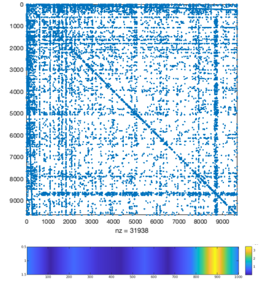

# A CUDA Lanczos Method to Compute Graph Centrality

<figure>
  
</figure>


In the study and analysis of networks it is of great importance to identify central and non-central nodes. There are countless ways of measuring the centrality of nodes in a network, all with slightly different interpretations of what it means to be central. Finding highly central and poorly central nodes is essential in maintaining and managing real life graphs and networks. 

The aim of this project is to compute the centrality of nodes in an undirected graph ```A^T=A```. The action of the exponential matrix function f(A)x = e^Ax will be used as a measure of node centrality. 

e^Ax will be approximated without forming  e^A explicitly, instead using Krylov subspace methods, most notably the Lanczos method. This makes computing e^Ax scalable to the limits of the memory hardware, which are tested in this project. 

This project computes the action of the matrix exponential on a vector (usually of ones) both in serial and in parallel using CUDA.

## Report

The accompanying report can be found at ```writeup.pdf```.

## Data
In order to run code, data must be downloaded from:

```https://drive.google.com/drive/folders/1HdyMdnjphMtafk8TBbWc0L-2V4OeWlmj?usp=sharing```

and untarred. Please replace the empty ```data/``` directory with the untarred ```data.tar```.

## Implementations

There are many implementations of the Lanczos method in this project directory:
  - A serial method, for details on how to run see ```serial/README.md```
  - A CUDA method using on-card multiplication. See ```parallel-mult-on-card/README.md```
  - A CUDA method using two cards. See ```parallel-two-cards/README.md```
  - A final CUDA implementation. Which uses a CUDA Lanczos method, and a multithreaded CBLAS multOut routine. See ```parallel-final/README.md```

All directories except ```final``` include tests that check the accuracy of the method and of kernels.
