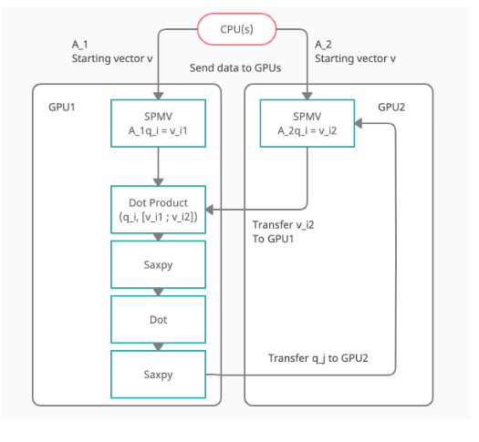

## Dual GPU Lanczos Method



A dual GPU CUDA Lanczos method is implemented in this directory. See the two card implementation in ```lib/cu_lanczos.cu```.

The only test in this directory is ```lanczos_test```

Run ```make lanczos_test``` to launch the CUDA lanczos algorithm on two cards. Performance is poor so the method is suitable for smaller matrices.

